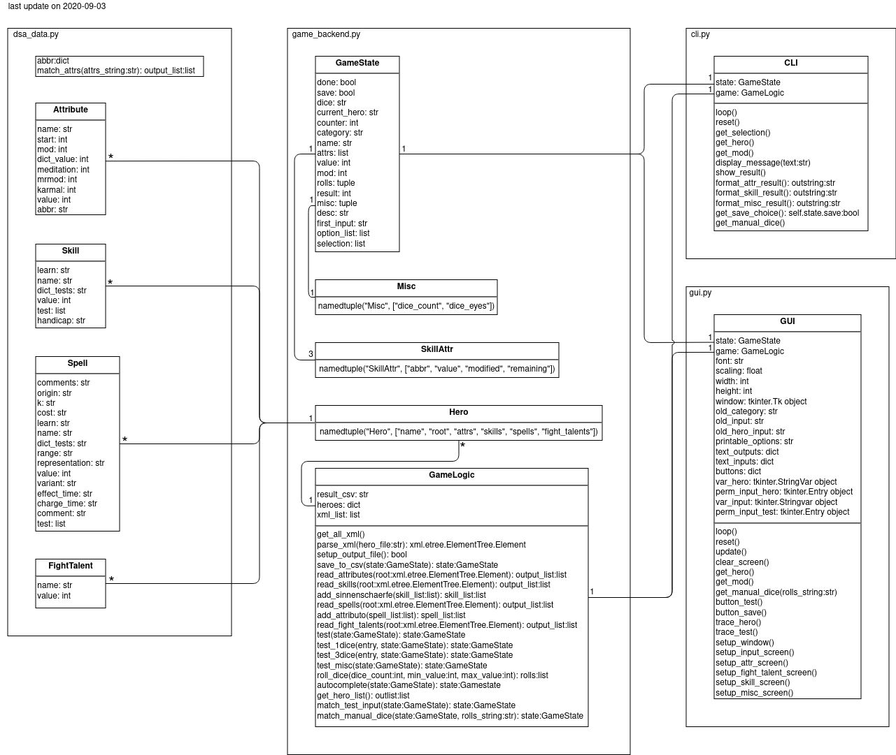
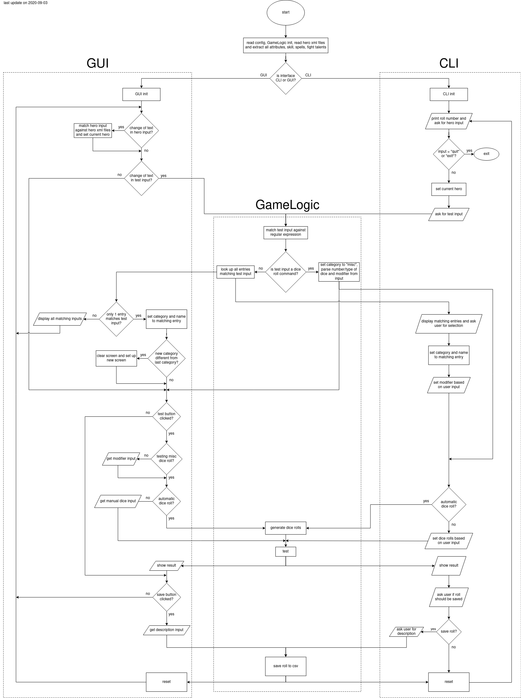

# DSATester
## Introduction

A small program to generate test results for DSA 4.1. Entries in the hero xml file (created by Helden-Software) are compared with dice rolls which can be generated or typed in. 
Additionally, any number of dice sums can be generated by typing the desired dice roll (e.g. "3d20" or "5d6+4")
The result can then be saved in a csv file.

Current supported entries which can be tested include:
* Eigenschaften
* Talente
* Zauber
* Kampftalente

Project progress can be viewed at: https://trello.com/b/TuCnQlQi/dsatester

## Technologies
* helden-software 5.5.3-1 (for character creation)
* Python3.8.5
* pyinstaller (to create executable)

## Launch
### Launching the executable
1. Place your xml file in the "executable" folder
2. Change the values in "config.txt" based on your preferences
3. Launch "main.exe"

### Running the python script
The program relies on the following modules:
re, tkinter, random, csv, os, datetime, xml, collections, dataclasses, operator

1. Place your xml file in the main folder
2. Change the values in "config.txt" based on your preferences
3. Launch "main.py"

# Diagrams
## Program structure

## Flowchart

